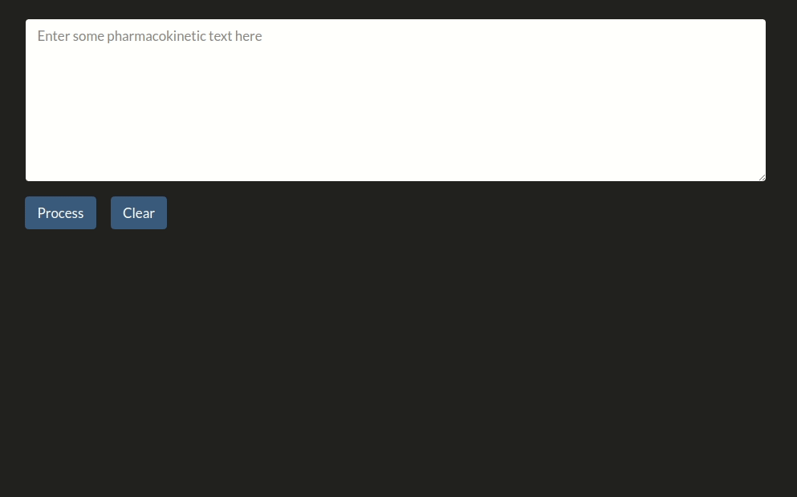

# PKNER

[](https://doi.org/10.5281/zenodo.4646970)

This repository contains code to perform Named Entity Recognition of Pharmacokinetic Parameteres in the scientific literature.

<p align="center">

</p>

## Install environment & download annotations

1. Create and activate a virtual environment with `python 3.8.12` installed

2. Install this repo to get started:

````bash
git clone https://github.com/PKPDAI/PKNER
cd PKNER
pip install -e .
````

## Download data and checkpoints

````bash
sh scripts/download_annotations.sh
sh scripts/download_pretrained_biobert_pkner.sh
````
## Trained spaCy inference

To use NER for PK parameters with spaCy make sure scispaCy is installed (`pip install scispacy`). Then install the NER package for PK parameters through:

````
pip install https://pkannotations.blob.core.windows.net/nerdata/trained_models/en_pk_ner-0.0.0.tar.gz
````

You can use the model through:

```python
import spacy

nlp = spacy.load("en_pk_ner")
doc = nlp("Parameter estimations for a subject of 34kg indicated values of midazolam clearance of 34.7l·h-1, a central volume of distribution of 27.9l and a peripheral volume of distribution of 413l.")
for ent in doc.ents:
    print(ent)
#>>> clearance
#>>> central volume of distibution
#>>> peripheral volume of distribution
```

## Inference and evaluation with PKNER BERT-based models

```shell
python scripts/evaluate_bert.py \
   --model-checkpoint checkpoints/biobert-ner-trained.ckpt \
   --predict-file-path data/test.jsonl \
   --display-errors \
   --batch-size 256 \
   --gpu \
   --n-workers 12
```